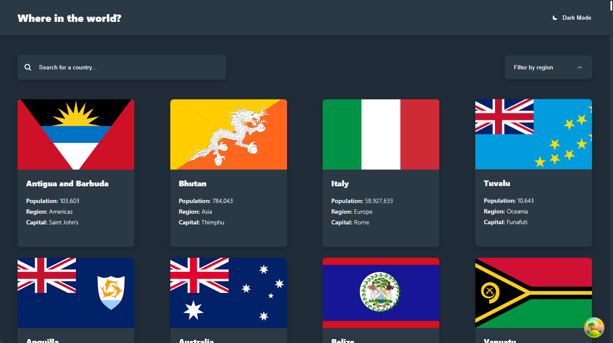
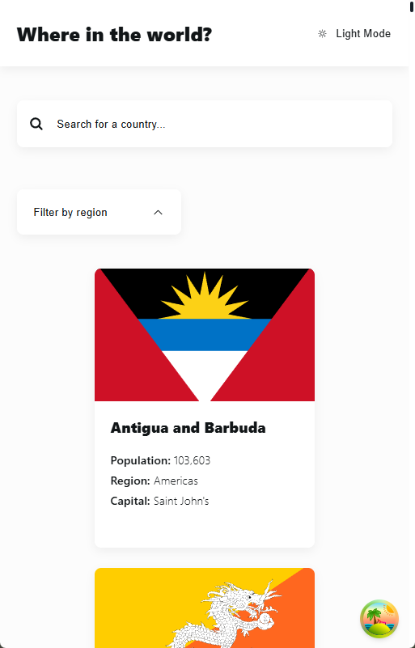
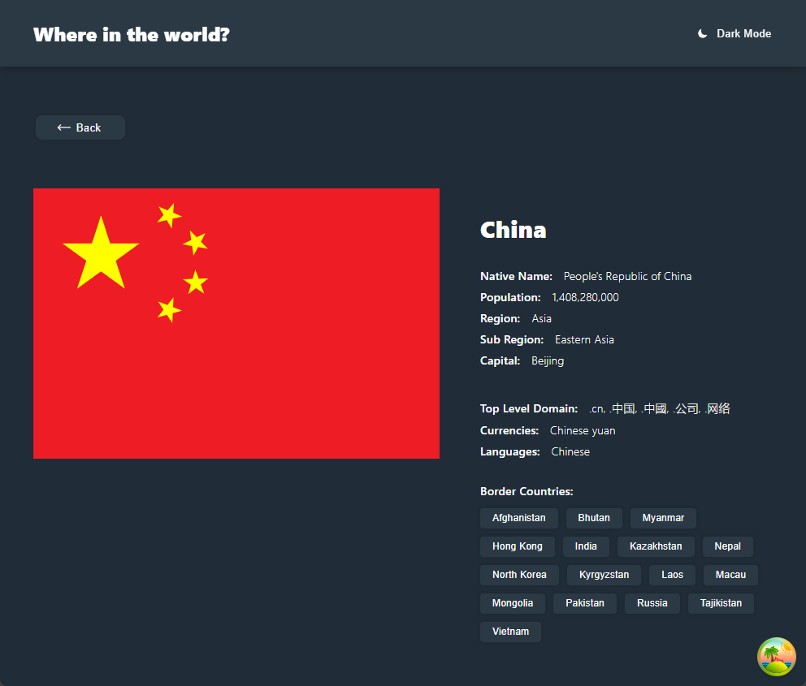
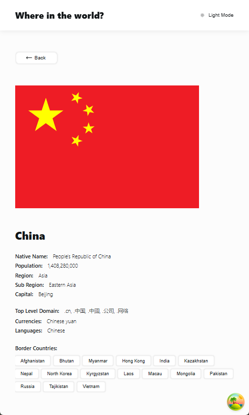

# REST Countries API with Color Theme Switcher

[](https://rsbuild.dev/)
[](https://react.dev/)
[](https://www.typescriptlang.org/)
[](https://tanstack.com/query)
[](https://vitest.dev/)
[](https://www.i18next.com/)

Modern, responsive single-page application built for the Frontend Mentor challenge.

[](https://country-api-switcher-919b75.gitlab.io/)

[](https://vadplot94.github.io/country-api-switcher/)

## 📸 Screenshots

### Desktop (Main Page)



### Mobile (Main Page)



### Desktop (Country Detail)



### Mobile (Country Detail)



## 📦 Installation & Usage

```bash
# Clone the repository
git clone https://gitlab.com/frontendmentor4274851/country-api-switcher.git
cd country-api-switcher

# ────────────────────────────────────────────────
# Development & other commands
# ────────────────────────────────────────────────

# Start development server
npm run dev
# → http://localhost:3000 (or custom port)

# Build for production
npm run build

# Preview production build locally
npm run preview

# Run tests (Vitest)
npm run test

# Run tests in watch mode + nice UI dashboard
npm run test:ui

# Generate coverage report
npm run test:coverage

```

## 🔗 Links

- GitHub Repo: [GitHub Repo](https://github.com/VadPlot94/country-api-switcher)
- GitHub Demo: [GitHub Demo](https://vadplot94.github.io/country-api-switcher/)
- GitLab Repo: [GitLab Repo](https://gitlab.com/frontendmentor4274851/country-api-switcher)
- GitLab Demo: [GitLab Demo](https://country-api-switcher-919b75.gitlab.io/)
- Challenge: [REST Countries API with color theme switcher](https://www.frontendmentor.io/challenges/rest-countries-api-with-color-theme-switcher-5cacc469fec04111f7b848ca)
- API: [REST Countries API](https://restcountries.com)
  - Offline mode: local JSON file with all countries (`public/assets/countries.v3.1.json`)
- Repository: https://gitlab.com/frontendmentor4274851/country-api-switcher
- Figma/Style Guide — `No Figma!` Create UI by style-guide.md in starter files and png screenshots

## 🚀 Tech Stack (used technologies)

- **Build Tool**: Rsbuild (Rspack-based, extremely fast)
- **Frontend**: React 19, TypeScript 5
- **Routing**: React Router v6
- **Data Fetching & Cache**: TanStack Query (React Query) v5 (manage/request API data instead fetch)
- **Virtualization**: TanStack Virtual (for virtual country list scrolling)
- **State Management**: Redux Toolkit + RTK Query (optional / internal UI state management)
- **Styling**: SCSS + BEM methodology (mixins), CSS Modules (experimental - try a bit/not implemented)
- **Icons**: Heroicons (mini) [https://heroicons.com/mini]
- **Internationalization**: i18next + react-i18next + browser language detector
- **Schema Validation**: Zod (URL params & queries validation before usage), DOMPurify (XSS protection for search query)
- **Testing**: Vitest + React Testing Library (unit tests)
- **Code quality**: Eslint + Prettier (import sorting, aliases)
- **Dev Tools**:
  - React Developer Tools + React profiler (for performance)
  - Redux DevTools(similar as Tanstack query devtools - but we invalidate here not API data but inner state of React application)
  - TanStack Query Devtools(invalidate/reload/trigger errors for getting API data)
- **Other**: -

## ✨ Features (Functional requirements)

- 🌗 Dark / Light theme toggle (persisted)
- 🔍 Search by country name
- 🌍 Filter by region
- 📄 Detailed country page (click on flag or via url)
- 🔗 Navigation to appropriate country description via bordering countries buttons (Detailed country page)
- 🌐 Multi-language support: English & Russian
- ⚡ High performance: virtualized list (TanStack Virtual), React.memo + hooks
- 📴 Offline mode (local JSON + future Service Worker)
- ♿ Accessibility: keyboard navigation(tab-index - using Tab button to interact with page), semantic HTML
- 🛣️ Deep linking & smart language redirection
- 🛡️ Input sanitization & URL params validation (Zod)
- 🌐 Routing & Language Behavior(open pages with different urls):
  - Realized routes: main page(`/:lang?`), country description page(`:lang?/country/:cca3`), not found page(`*` - any invalid url)
  - Transferring selected country through navigation state
  - Redirection to supported languages
  - GitLab/Github Pages can have problems with Deep Linking → return 404 on routing with /:lang? → use query param instead: `/?lng=ru`
  - Examples (`ITA` is cca3 code for appropriate country):

    | URL example          | Result                                                       | Language |
    | :------------------- | ------------------------------------------------------------ | -------: |
    | `/`                  | Main page                                                    |       EN |
    | `/ru`                | Main page                                                    |       RU |
    | `/?lng=ru`           | Main page                                                    |       RU |
    | `/?virtualTable=true`| Main page (with virtual scrolling for countries list)        |       EN |
    | `/country/ITA`       | Country description page (Italy)                             |       EN |
    | `/ru/country/ITA`    | Country description page (Italy)                             |       RU |
    | `/en/country/ITA`    | Country description page (Italy) (redirect → `/country/ITA`) |       EN |
    | `/fr/country/ITA`    | Unsupported lang (redirect → `/country/ITA`)                 |       EN |
    | `/blabla`            | Redirect to `/` (EN)                                         |       EN |
    | any invalid url path | Not Found page                                               |        — |

## 🔧 Non-functional highlights

### 1. Performance

- Virtual scrolling for country list  
  → Implemented with TanStack Virtual (`useWindowVirtualizer`)  
  → Can be forced via query param: `?virtualTable=true`  
  → Example: http://localhost:3000/?virtualTable=true
- Memoization & optimization hooks  
  → `React.memo`, `useMemo`, `useCallback` used where appropriate
- Performance profiling  
  → React Developer Tools extension (Components, Profiler tabs in Chrome dev tools)
- Lazy-loaded translations (i18next-http-backend)

### 2. Reliability

- Custom Not Found page for invalid routes
- Offline mode support  
  → Local JSON fallback (`public/assets/countries.v3.1.json`)  
  → Planned: Service Worker + preloading of flag images

### 3. Usability

- Smooth animations & transitions (partially implemented)
- Partial Accessibility improvements  
  → Keyboard navigation (Tab keyboard button navigation focus support)  
  → Semantic HTML structure
- Supported languages: English(`en`) & Russian(`ru`)
- Deep linking support (shareable URLs, possibility to open pages through different understandable for user urls)
- Internationalization (i18n)  
  → `i18next` core  
  → `react-i18next` integration  
  → `i18next-browser-languagedetector` (auto-detection. Ex: through path param (`/ru`), query param(`?lang=ru`) and etc. See docs)  
  → `i18next-http-backend` (lazy loading of translations)

### 4. Security

- Search input sanitization
  → DOMPurify.sanitize() for displayed search results  
  → React automatically escapes values in `<input value={...}>`
- URL parameter validation  
  → `zod` package - schema validation for `cca3` country codes before API calls

### 5. Maintainability

- Redux middlewares explored
- InversifyJS DI container experiment → **removed**  
  → Reasons:
  - Rsbuild performance drop due to decorator(@inject, injectable) processing - better do not use Inversify or do not use decorators at all
  - Circular dependency issues with Redux slices & middleware (not allow to inject dependencies from container in it)
- CSS Modules experiment (tried on one component) → **removed(attempts saved in \_\_css_modules_test folder)**
  → Purpose of modules usage: css classes can be used like object in JSX/TSX files with typization and tips
  - use camelcase for classes like: '.containerContent' instead '.container-content' or appCssStyles['app__container-content']
  - Example: `<div className={appCssStyles.containerContent} />` - we know exactly that containerContent class exist in css and not removed
    → Issues with nested selectors & type generation:
  - Need to generate types for TS typification
  - https://github.com/Quramy/typed-css-modules
  - npm run types:css("types:css": "tcm -p \"src/\*_/_.module.{css,scss}\" --camelcase") - need run this command every time when css changed
    - !!!**Not implemented** - **problems**!!!:
      - a) .app .header {} - such selector not working. After generation in html we get hashing classes: .app-tysRT .header {} - styles will never find
        - Solution: keep global styles in `global.css`, use modules only locally. However can not find way to fix this problem event with this approach
      - b) typed-css-modules - generated app.css.d.ts can be placed only near app.css file. Can not find way to move d.ts file in any random folder
- SCSS + BEM methodology applied to main layout files (one or two files only)

### 6. Portability

- Fully responsive design
  → Mobile, tablet, desktop layouts

### 7. Operational Requirements

- Basic logging (console + potential structured logging in future)

### 8. Testability

- Vitest as modern, fast alternative to Jest for unit tests

### 9. CI / CD (Deploy)

- GitLab/GitHub CI: tests, coverage, build & Pages deployment
- Test reports & coverage visualization in MRs
- GitHub deployed app in it own folder (add BaseUrl using GITHUB_ACTIONS and other env variables)

## 🛠️ TODO / Planned

- Full unit & integration tests (Redux Toolkit slices + components)
- Service Worker + Offline-first flags preloading
- CI integration (tests + deployment preview)
- Improve accessibility (ARIA labels, screen reader testing)
- Add more animations / transitions
- Explore TanStack Router as alternative (type-safe routing)

## 📝 Notes

- This project experiments with modern tools (Rsbuild + TanStack stack + RTK) to achieve great DX and performance. Some approaches (Inversify DI, full CSS Modules) were tested and removed due to complexity / performance trade-offs.
- Feedback and contributions are welcome! 🚀
- Made with ❤️ by Vadzim
